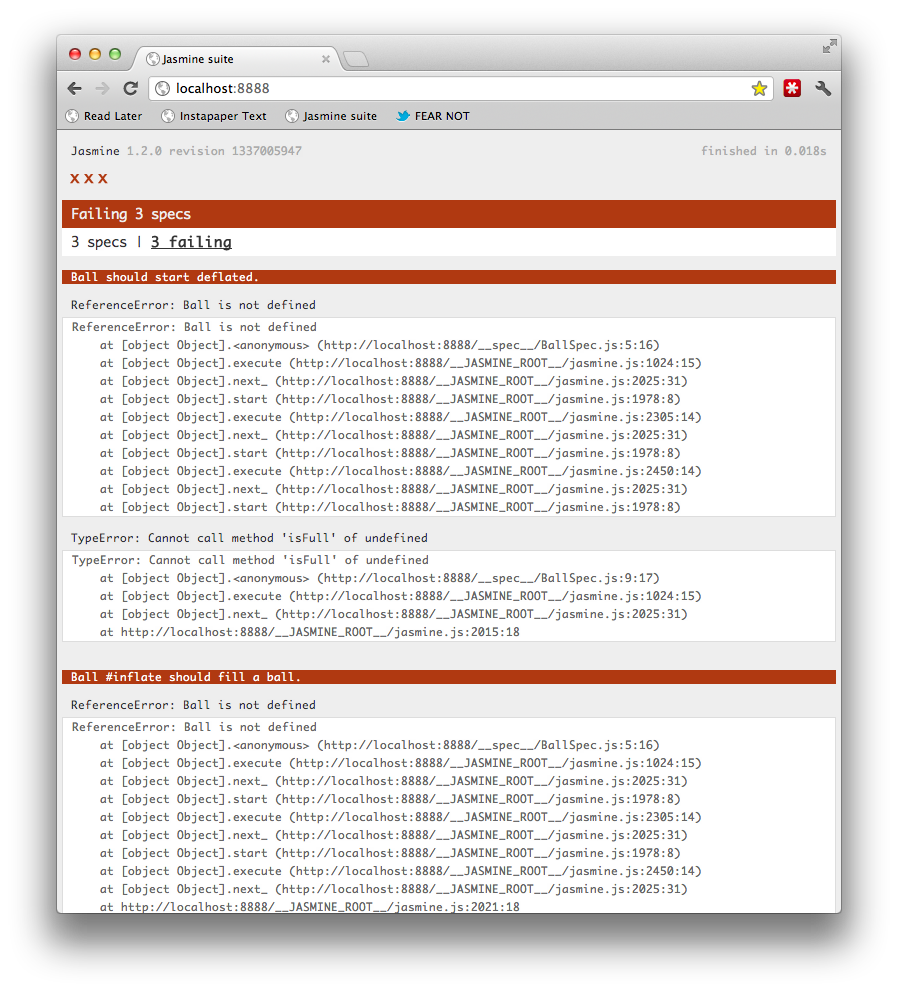
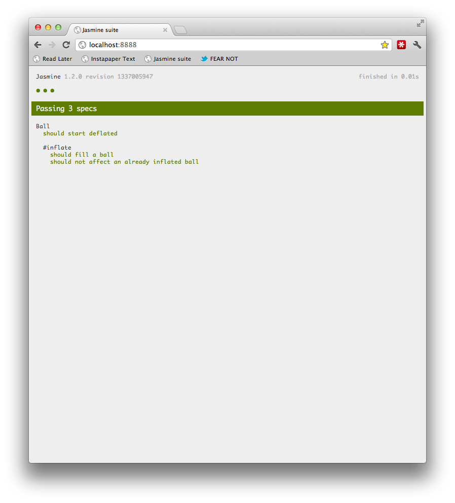
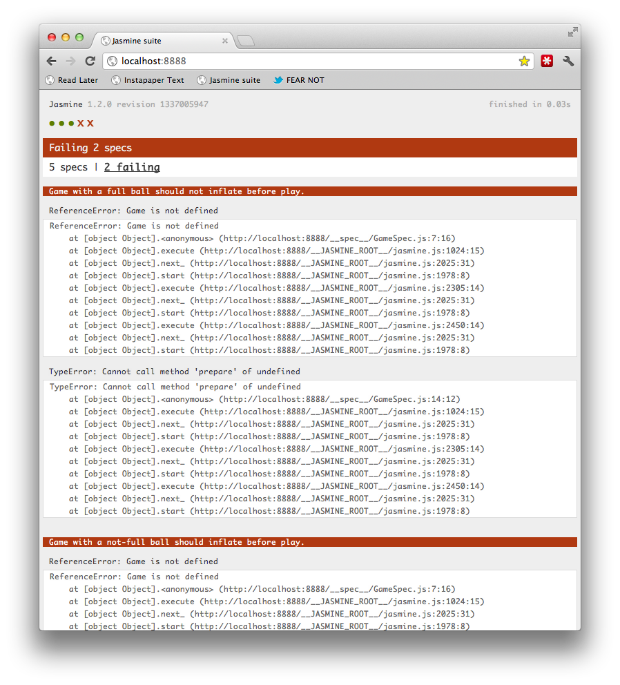
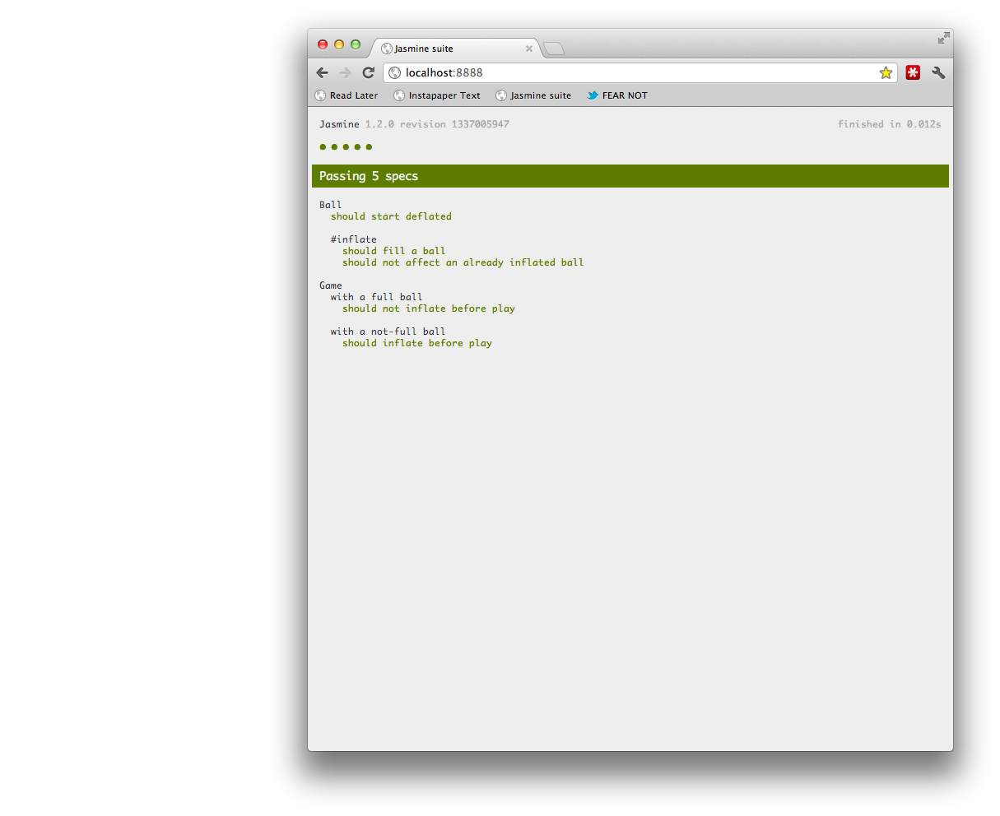
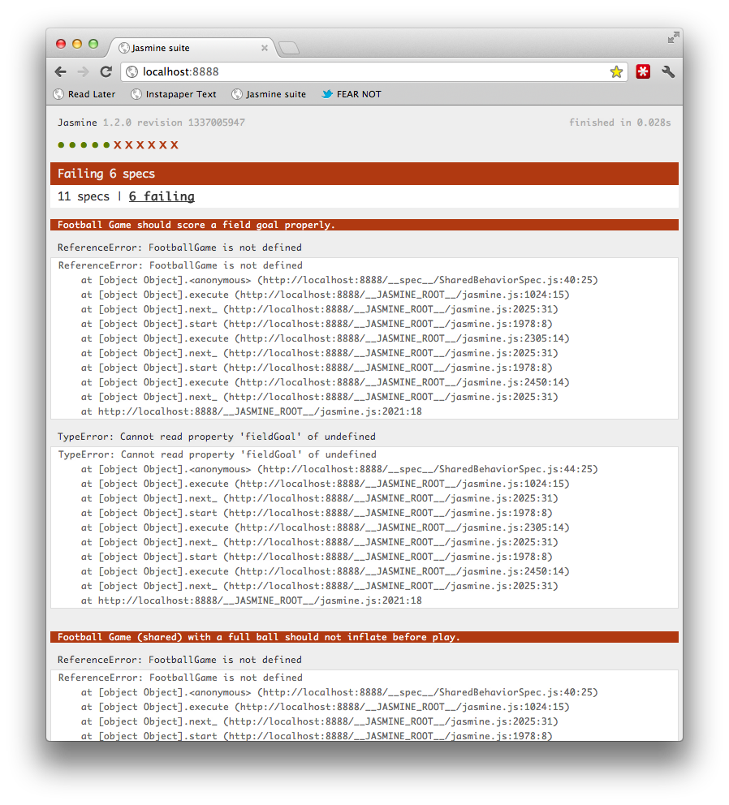

# Jasmine @ Scribd

!SLIDE

 
## @ Scribd

## Well-behaved JS Testing

### [Davis W. Frank](mailto:dwfrank@pivotallabs.com) | [Pivotal Labs](http://pivotallabs.com) | [Bio](http://dwf.bigpencil.net)

!SLIDE

# BDD for JavaScript

!SLIDE

# 'RSpec for JS'

### _Making JavaScript BDD safe for_
### _Rubyists since 2009_

!SLIDE

# No DOM

!SLIDE

# No Frameworks

!SLIDE

# No Request/Response

!SLIDE

# Where?

!SLIDE


!SLIDE


!SLIDE node


!SLIDE

# How?

!SLIDE

## (Follow along at home)

### [Example Project](https://github.com/infews/jasmine_example_project)
`github.com/infews/jasmine_example_project`

!SLIDE

```javascript
describe("Ball", function () {
  var ball;

  beforeEach(function() {
    ball = new Ball();
  });

  it("should start deflated", function() {
    expect(ball.isFull()).toEqual(false);
  });

  describe("#inflate", function () {
    beforeEach(function() {
      ball.inflate();
    });

    it("should fill a ball", function() {
      expect(ball.isFull()).toEqual(true);
    });

    it("should not affect an already inflated ball", function() {
      ball.inflate();
      expect(ball.isFull()).toEqual(true);
    });
  });
});
```

!SLIDE



!SLIDE

```javascript
function Ball() {
  var self = this;

  var full = false;

  self.inflate = function() {
    full = true;
  };

  self.isFull = function() {
    return full;
  };

  return self;
}
```

!SLIDE



!SLIDE

# Disabling Specs & Suites

!SLIDE 

```javascript
describe("A suite", function() {
  it("should have enabled specs", function() {
    expect(true).toEqual(true);
  });

  xit("should have disabled specs", function() {
    expect(true).toEqual(true);
  });

  xdescribe("can have disabled suites", function() {
    it("should have enabled specs that don't run", function() {
      expect(true).toEqual(true);
    });
  });
});
```

!SLIDE

# Spies

## mocks, stubs, fakes, doubles

!SLIDE

```javascript
describe("Game", function () {
  var game, ball;

  beforeEach(function() {
    ball = new Ball();
    spyOn(ball, 'inflate').andCallThrough();
    game = new Game();
  });

  describe("with a full ball", function() {
    beforeEach(function() {
      ball.inflate();
      ball.inflate.reset();
      game.prepare(ball);
    });

    it("should not inflate before play", function() {
      expect(ball.inflate).not.toHaveBeenCalled();
    });
  });

  describe("with a not-full ball", function() {
    beforeEach(function() {
      game.prepare(ball);
    });

    it("should inflate before play", function() {
      expect(ball.inflate).toHaveBeenCalled();
    });
  });
});
```

!SLIDE



!SLIDE

```javascript
function Game() {
  var self = this;

  self.prepare = function(ball) {
    if (ball.isFull()) {
      return;
    }

    ball.inflate();
  };

  return self;
}
```
!SLIDE



!SLIDE

# Let's Get Practical

!SLIDE question

## "How do I manage a big project?"

!SLIDE

# Jasmine Gem

## Better than a barrel of `<script>`
	
### It's not just for Ruby projects

!SLIDE question

## "How do I perform test 

## setup & teardown?"

!SLIDE

```javascript
beforeEach(function() {
	// everything in here will run before each spec
});
```

!SLIDE question

## "How do I test timer-based code?"

!SLIDE

### `jasmine.Clock.useMock();`

!SLIDE

```javascript
describe("Manually ticking the Jasmine Mock Clock", function() {
  var timerCallback;

  beforeEach(function() {
    timerCallback = jasmine.createSpy('timerCallback');
    jasmine.Clock.useMock();
  });

  it("causes a timeout to be called synchronously", function() {
    setTimeout(function() {
      timerCallback();
    }, 100);

    expect(timerCallback).not.toHaveBeenCalled();
    jasmine.Clock.tick(101);
    expect(timerCallback).toHaveBeenCalled();
  });

  it("causes an interval to be called synchronously", function() {
    setInterval(function() {
      timerCallback();
    }, 100);

    expect(timerCallback).not.toHaveBeenCalled();

    jasmine.Clock.tick(101);
    expect(timerCallback.callCount).toEqual(1);

    jasmine.Clock.tick(50);
    expect(timerCallback.callCount).toEqual(1);

    jasmine.Clock.tick(50);
    expect(timerCallback.callCount).toEqual(2);
  });
});
```

!SLIDE question

## "How do I test AJAX calls?"

!SLIDE

### `jasmine.Ajax.useMock();`

!SLIDE 
```javascript
describe("TwitterApi#search", function(){
  var twitter, request, callbacks

  beforeEach(function(){
    twitter = new TwitterApi();
    callbacks = new AjaxCallbacks();

    twitter.search('basketball', callbacks);

    request = mostRecentAjaxRequest();
  });

  it("calls Twitter with the correct url", function(){
    expect(request.url).toEqual("http://search.twitter.com/search.json?q=basketball");
  });
});
```

!SLIDE

# Use Response Fixtures

!SLIDE
  
```javascript
describe("on success", function(){

  beforeEach(function(){
    request.response(TestResponses.search.success);
  });

  it("calls onSuccess with an array of Tweets", function(){
    var successArgs = callbacks.onSuccess.mostRecentCall.args[0];

    expect(callbacks.onSuccess).toHaveBeenCalledWith(jasmine.any(Array));
    expect(successArgs.length).toEqual(15);
    expect(successArgs[0]).toEqual(jasmine.any(Tweet));
  });
});
```

!SLIDE question

## "How do I write 
## asynchronous specs?"

!SLIDE

# Are you writing an Async API?

## Use `waitsFor()` & `runs()`

!SLIDE

```javascript
describe('when there are more elements below the currently-selected element', function() {
  var blurEvent, focusEvent;
  beforeEach(function() {
    $('body')
      .bind('blur.justKidding',  function(e) { blurEvent  = e; })
      .bind('focus.justKidding', function(e) { focusEvent = e; })
  });

  it('should select the next element', function() {
    runs(function() {
      $('body').simulate('keypress', { charCode: 'j'.charCodeAt(0) });
    });

    waitsFor(function() {
      return blurEvent || focusEvent;
    }, "events to fire", 1000);

    runs(function() {
      expect($('.current').html()).toEqual('Jakob became a crab farmer');
    });
  });
});
```
### [https://gist.github.com/803024](https://gist.github.com/803024)

!SLIDE question

## "How do I share code across tests?"

!SLIDE

# It's JavaScript

## Use a `function`

!SLIDE

```javascript
function sharedBehaviorForGame(context) {
  describe("(shared)", function() {
    var ball, game;
    beforeEach(function() {
      ball = context.ball;
      game = context.game;

      spyOn(ball, 'inflate').andCallThrough();
    });

    describe("with a full ball", function() {
      beforeEach(function() {
        ball.inflate();
        ball.inflate.reset();
        game.prepare(ball);
      });

      it("should not inflate before play", function() {
        expect(ball.inflate).not.toHaveBeenCalled();
      });
    });

    describe("with a not-full ball", function() {
      beforeEach(function() {
        game.prepare(ball);
      });

      it("should inflate before play", function() {
        expect(ball.inflate).toHaveBeenCalled();
      });
    });
  });
}
```

!SLIDE

```javascript
describe("Football Game", function() {
  var football = {};

  beforeEach(function() {
    football.ball = new Football();
    football.game = new FootballGame();
  });

  it("should score a field goal properly", function() {
    expect(football.game.fieldGoal.points).toEqual(3);
  });

  sharedBehaviorForGame(football);
});
```

!SLIDE

```javascript
describe("Basketball Game", function() {
  var basketball = {};

  beforeEach(function() {
    basketball.ball = new Basketball();
    basketball.game = new BasketballGame();
  });

  it("should score a field goal properly", function() {
    expect(basketball.game.fieldGoal.points).toEqual(2);
  });

  sharedBehaviorForGame(basketball);
});
```

!SLIDE



!SLIDE

```javascript
function Football() {
  var self = new Ball();

  return self;
}

function FootballGame() {
  var self = new Game();

  self.fieldGoal = {
    points: 3
  };

  return self;
}
```

!SLIDE

```javascript
function Basketball() {
  var self = new Ball();

  return self;
}

function BasketballGame() {
  var self = new Game();

  self.fieldGoal = {
    points: 2
  };

  return self;
}
```

!SLIDE


!SLIDE

# Mobile?

!SLIDE

# Mobile _web_

!SLIDE

# ...or JS in Native Containers

!SLIDE

# Develop in the Browser

## until you can't

!SLIDE

# Test _your_ Code
<br/><br/>
# not the Framework

## Read [The Humble Dialog Box](http://www.objectmentor.com/resources/articles/TheHumbleDialogBox.pdf)

!SLIDE

# Questions?

!SLIDE

# Thanks

### `expect(jasmine).toBeDefined();`


